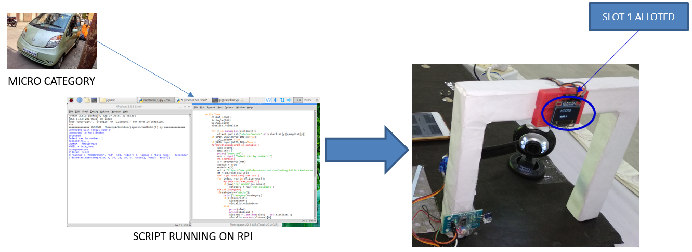
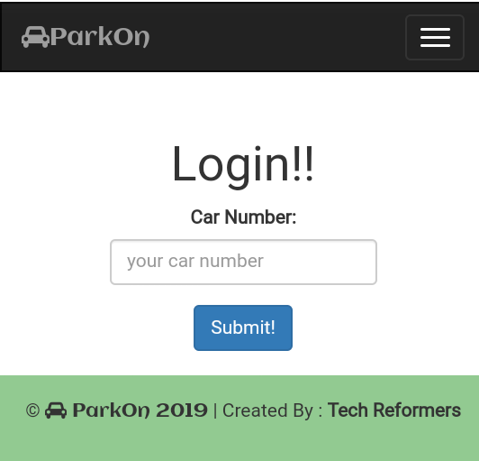
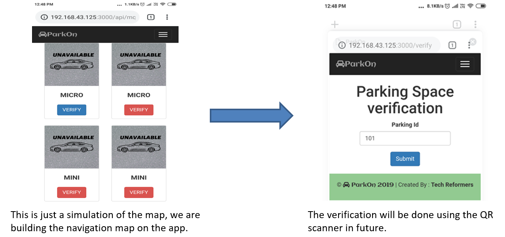
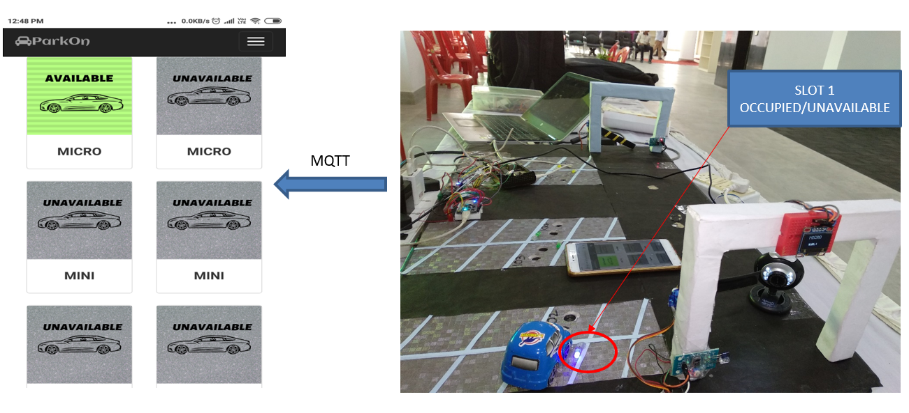
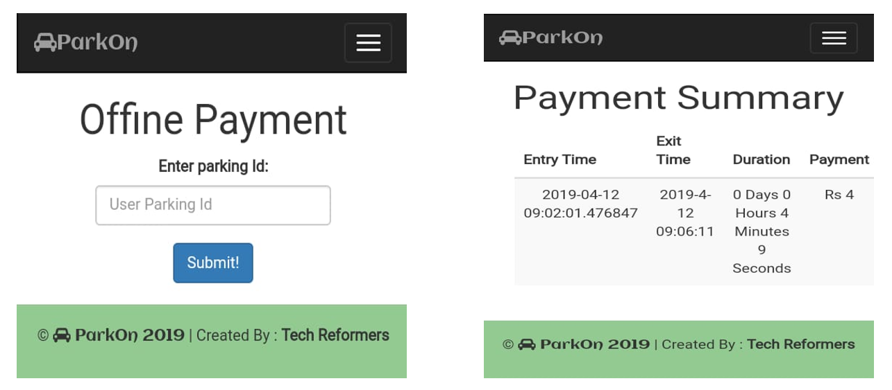

# Parkon (Automated Organizational Parking)

STEP 1: Image Processing of the cars at the Entry

STEP 2: LOGIN

STEP 3: NAVIGATION AND VERIFICATION

STEP 4: REAL TIME OCCUPANCY

STEP 5: PAYMENT AND SUMMARY

